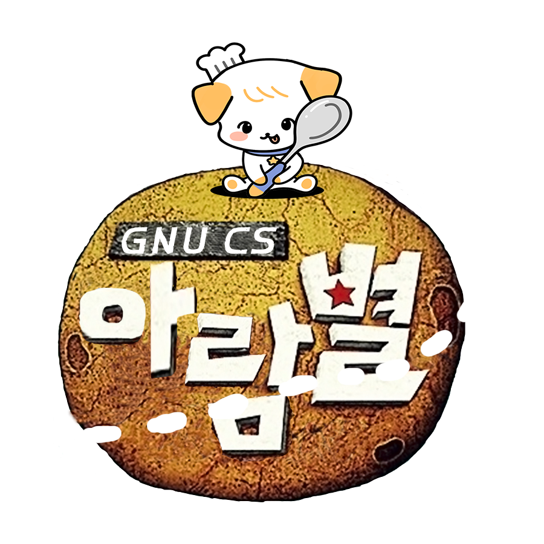
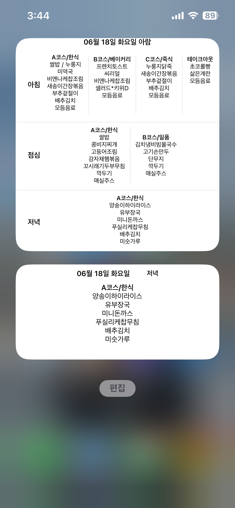
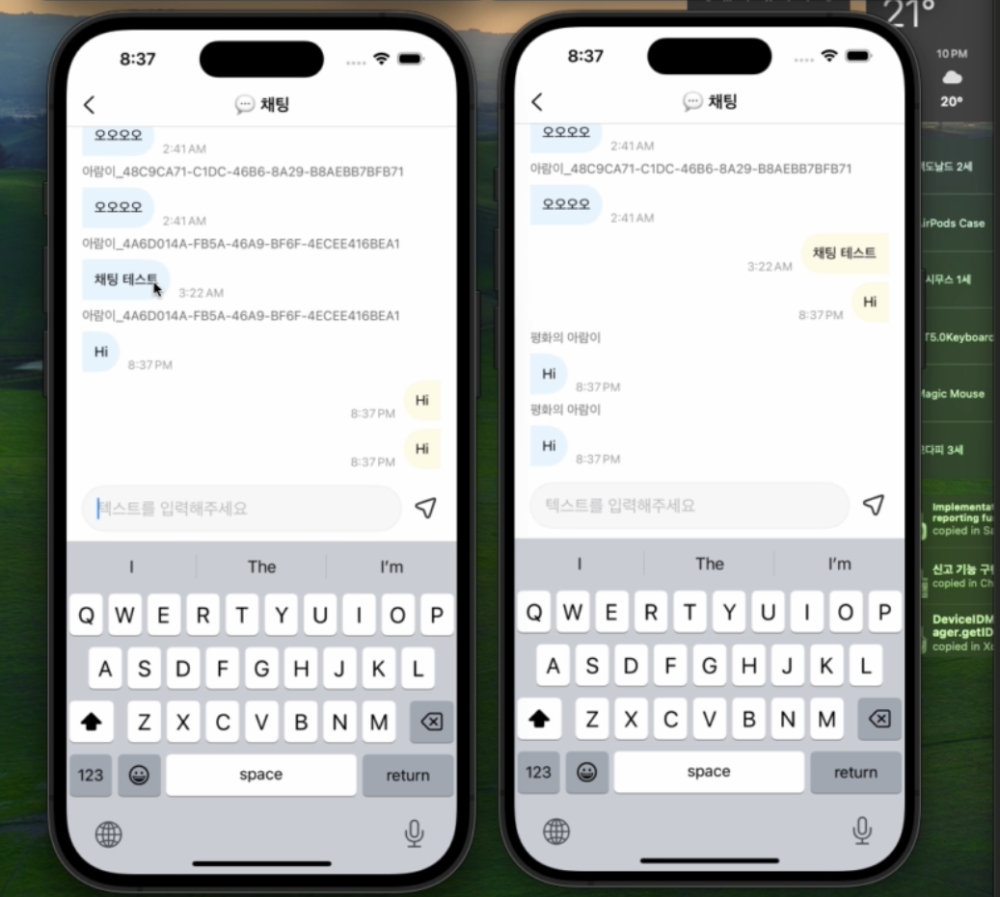

# 아람별 서비스

## 목차

- [1. 서비스 소개](#1-서비스-소개)
- [2. 서비스 기능 소개](#2-서비스-기능-소개)
- [3. 서비스 성과](#3-서비스-성과)
- [4. 서비스 설계](#4-서비스-개발)
    - [4.1 WebSocket 채팅 애플리케이션 개발](#41-websocket-채팅-애플리케이션-개발)

## 1. 서비스 소개

[아람별 - App Store 앱](https://apps.apple.com/kr/app/%EC%95%84%EB%9E%8C%EB%B3%84/id6446250930)

아람별은 경상대학교 기숙사 식당 메뉴 정보 제공 서비스입니다.
기숙사 식당 메뉴 확인이 어려운 학생들을 위하여 , iOS앱 & 위젯 & 웹으로 구현되었습니다.
현재는 400명이상의 재학생들이 사용 중입니다. 

## 2. 서비스 기능 소개

주요 기능은 식단 메뉴 확인 , 채팅 기능이 있습니다.

  
  

► 식단 메뉴 확인

모바일과 위젯으로 식단 메뉴를 확인할 수 있습니다.

► 채팅 기능

재학생들끼리 , 오늘 밥의 맛은 어떤 지 , 식당에 뭐가 나왔는지 등을 자유롭게 채팅할 수 있습니다.

## 3. 서비스 성과

iOS 다운로드 수 : 420명 +

## 4. 서비스 개발

- 아람별 iOS Version 1.0을 개발하였습니다.
- 아람별 사용자 접속 패턴 파악을 위해 ELK 스택을 이용하여 로깅 파이프라인을 구축하여습니다.
- 아람별 커뮤니티를 위한 채팅 기능을 개발하였습니다.
- 현재 Repository는 채팅에 관한 코드만 포함되어 있습니다.

### 4.1 WebSocket 채팅 애플리케이션 개발

Spring Boot와 STOMP 프로토콜을 이용하여 WebSocket 채팅 기능을 구현한 프로젝트입니다.
채팅 메시지의 신뢰성과 안정성을 보장하기 위해 RabbitMQ를 메시지 브로커로 사용하고 있습니다.

개발 내용

1. 실시간 채팅  
   STOMP 프로토콜을 사용하여 WebSocket을 통해 실시간으로 채팅 메시지를 주고받을 수 있습니다.
   채팅 메시지는 STOMP 엔드포인트를 통해 서버와 클라이언트 간에 교환됩니다.
   

2. 메시지 브로커   
   RabbitMQ를 사용하여 메시지 전송 및 수신을 처리합니다.
   메시지 브로커를 사용하여 메시지 누락 및 세션 손실 문제를 해결하고, 메시지가 안정적으로 전달되도록 합니다.
   

3. SSL/TLS 프로토콜 사용 및 JWT 토큰 인증을 통한 소켓 메세지 보안 유지  
   SSL/TLS 프로토콜을 사용하여 데이터 암호화를 지원합니다.
   JWT 토큰을 사용하여 사용자 인증을 처리합니다.
   

4. RECEIPT 기능   
   클라이언트의 메시지를 수신하면 서버에서 수신 확인 메시지를 보내어 메시지 손실을 방지합니다.

